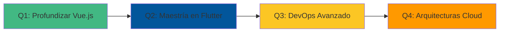

# ¡Hola!  Soy Alberto Emiliano Grajales Jiménez 👋

<div align="center">

### 🚀 Desarrollador Full-Stack | 💻 Arquitecto de Soluciones Multiplataforma | ☁️ DevOps Enthusiast


</div>

---

## 👨‍💻 Sobre Mí

> *"La tecnología es mejor cuando une a las personas"* - Matt Mullenweg

Soy un desarrollador apasionado por crear soluciones tecnológicas completas, desde interfaces de usuario intuitivas hasta infraestructuras de servidor robustas. Mi filosofía es simple: **código limpio, arquitectura escalable y aprendizaje continuo**. 

🔭 Actualmente explorando el ecosistema completo de desarrollo: frontend moderno, backend resiliente y administración de sistemas Linux. 

🌱 En constante evolución, combinando desarrollo web, aplicaciones móviles nativas y configuración de servidores seguros. 

⚡ Dato curioso: Me encanta optimizar tanto el rendimiento del código como la seguridad del sistema operativo.

---

## 🛠️ Arsenal Tecnológico

### 💻 Lenguajes de Programación

```text
JavaScript   ████████████░░░░░░░░  60%
C#           ███████████░░░░░░░░░  55%
Python       ██████████░░░░░░░░░░  50%
Kotlin       ████████░░░░░░░░░░░░  40%
SQL          ██████████░░░░░░░░░░  50%
HTML/CSS     █████████████░░░░░░░  65%
```

### 🎨 Frontend Development

<p align="left">
  
  
  
  
  
  
</p>

### 📱 Desarrollo Móvil & Multiplataforma

<p align="left">
  
  
  
</p>

### ⚙️ Backend & Frameworks

<p align="left">
  
  
  
  
</p>

### 🗄️ Bases de Datos

<p align="left">
  
  
</p>

### 🐧 Administración de Sistemas & DevOps

<p align="left">
  
  
  
  
</p>

---

## 💼 Lo Que Hago

<table>
<tr>
<td width="50%">

### 🎨 Frontend Moderno
- ✨ SPAs interactivas con **React** y **Vue.js**
- 🎭 Interfaces dinámicas con **Blazor**
- 📐 Diseño responsive y accesible
- 🚀 Optimización de rendimiento web

</td>
<td width="50%">

### 📱 Desarrollo Multiplataforma
- 📲 Apps nativas con **Flutter**
- 🔷 Soluciones empresariales con **.NET MAUI**
- 📱 Desarrollo Android con **Kotlin**
- 🌐 PWAs y aplicaciones híbridas

</td>
</tr>
<tr>
<td width="50%">

### ⚙️ Backend & APIs
- 🔌 APIs RESTful con **Express.js**
- 🗄️ Gestión de bases de datos **MySQL**
- 🐍 Automatización con **Python**
- 🔐 Autenticación y seguridad

</td>
<td width="50%">

### 🖥️ Administración de Servidores
- 🐧 Configuración de servidores **Linux**
- 🔒 Hardening con **SELinux**
- 🌐 Deploy de aplicaciones web
- 📊 Monitoreo y optimización

</td>
</tr>
</table>

---

## 🎯 Proyectos Destacados

<details>
<summary>🔍 Ver mis proyectos</summary>

### 🌐 Aplicaciones Web Full-Stack
- Sistema de gestión con React + Express + MySQL
- Dashboard administrativo con Blazor y SQL Server
- SPA moderna con Vue.js y backend Node.js

### 📱 Aplicaciones Móviles
- App multiplataforma con Flutter
- Aplicación empresarial con .NET MAUI
- Proyecto nativo Android con Kotlin

### 🛠️ Infraestructura
- Servidor web seguro con SELinux
- Pipeline de deployment automatizado
- Configuración de entornos de desarrollo

</details>

---

## 📊 Estadísticas de GitHub

<div align="center">
  
  
</div>

---

## 🎓 Roadmap de Aprendizaje 2025



- [ ] **Vue.js Avanzado**: Vuex, Composition API, Nuxt.js
- [ ] **Flutter Pro**: State management, animaciones complejas
- [ ] **Kotlin Nativo**: Jetpack Compose, Coroutines
- [ ] **SELinux Mastery**: Políticas personalizadas, contextos avanzados
- [ ] **DevOps**: Docker, Kubernetes, CI/CD

---

## 🤝 Conectemos

<p align="center">
  <a href="https://github.com/Doker367">
    
  </a>
  <a href="mailto:tu-email@ejemplo.com">
    
  </a>
  <a href="https://linkedin.com/in/tu-perfil">
    
  </a>
</p>

---

<div align="center">

### 💭 Filosofía de Desarrollo

*"Primero hazlo funcionar, luego hazlo correcto, después hazlo rápido"*

**⭐ Si te gusta mi trabajo, considera darle una estrella a mis repositorios ⭐**


</div>

---

## 📚 Recursos y Aprendizaje

<details>
<summary>🔖 Mis recursos favoritos</summary>

### Frontend
- 📘 [Vue.js Documentation](https://vuejs.org/)
- 📗 [Flutter Cookbook](https://docs.flutter.dev/cookbook)
- 📕 [React Best Practices](https://react.dev/)

### Backend & DevOps
- 🐍 [Python for DevOps](https://www. python.org/)
- 🔒 [SELinux User's Guide](https://access.redhat.com/documentation/en-us/red_hat_enterprise_linux/8/html/using_selinux/)
- 🐧 [Linux Server Administration](https://www.linux. org/)

### Mobile
- 📱 [Kotlin Docs](https://kotlinlang.org/docs/home.html)
- 🎯 [Flutter Widget Catalog](https://docs.flutter.dev/ui/widgets)

</details>
