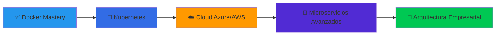

<div align="center">

# ¡Hola! 👋 Soy Alberto Emiliano Grajales Jiménez

### 🚀 Desarrollador Full-Stack | 💼 Especialista en . NET | 🐳 DevOps Engineer


**Construyendo soluciones empresariales • APIs escalables • Infraestructura en contenedores**

---

</div>

## 👨‍💻 Sobre Mí

> *"La mejor forma de predecir el futuro es construirlo"* - Peter Drucker

Soy un desarrollador **full-stack** con experiencia en la creación de **soluciones empresariales completas**, desde e-commerce hasta sistemas de logística y paquetería.  Me especializo en el ecosistema **. NET**, desarrollo móvil multiplataforma, y arquitecturas basadas en contenedores. 

🔭 **Actualmente trabajando en**: Proyectos empresariales con . NET, Docker y orquestación de contenedores

🌱 **Aprendiendo**: Kubernetes, microservicios avanzados y arquitecturas cloud-native

💼 **Experiencia en**: E-commerce, sistemas de paquetería, centros de datos, inventarios y aplicaciones móviles

⚡ **Apasionado por**: Contenedores, DevOps, APIs RESTful y automatización

---

## 🛠️ Stack Tecnológico

### 💻 Lenguajes & Frameworks

```text
C# / .NET       ████████████████░░░░  80% ⭐ Principal
JavaScript      ████████████░░░░░░░░  60%
SQL             ███████████░░░░░░░░░  55%
HTML/CSS        █████████████░░░░░░░  65%
Python          ██████░░░░░░░░░░░░░░  30%
Kotlin          ████████░░░░░░░░░░░░  40%
```

### 🎨 Frontend

<p align="left">
  
  
  
  
  
  
</p>

### ⚙️ Backend & APIs

<p align="left">
  
  
  
  
  
</p>

### 📱 Desarrollo Móvil

<p align="left">
  
  
  
</p>

### 🗄️ Bases de Datos

<p align="left">
  
  
</p>

### 🐳 DevOps & Infraestructura

<p align="left">
  
  
  
  
  
  
</p>

---

## 💼 Proyectos Reales

### 🛒 E-Commerce - "Cielo y Tierra" (Tienda Posh)

**Stack**: HTML, CSS, JavaScript, . NET Backend, MySQL

```yaml
Características:
  - 🛍️ Catálogo de productos con filtros
  - 🛒 Carrito de compras funcional
  - 💳 Sistema de pagos integrado
  - 👤 Gestión de usuarios y perfiles
  - 📊 Panel administrativo
  
Tecnologías: Frontend web + Backend .NET + Base de datos relacional
```

---

### 📦 Sistema de Paquetería Integral

**Stack**: .NET Core API, . NET MAUI Mobile, Docker, Nginx, MySQL

```yaml
Componentes:
  Web Platform:
    - 🌐 Portal de compra de guías de envío
    - 📋 Sistema de cotización en tiempo real
    - 💰 Procesamiento de pagos
    - 📊 Dashboard administrativo
    
  Mobile App (Choferes):
    - 📱 App con . NET MAUI
    - 🗺️ Monitoreo de rutas en tiempo real
    - 📍 Geolocalización de paquetes
    - ✅ Control de entregas
    - 📸 Captura de evidencias
    
  Backend:
    - 🔌 API RESTful en C# .NET
    - 🗄️ Base de datos MySQL
    - 🔐 Autenticación JWT
    - 📡 WebSockets para tracking en tiempo real
    
  Infraestructura:
    - 🐳 Contenedores Docker
    - 🔄 Nginx como reverse proxy
    - 🚀 Orquestación de servicios
```

**Logros**:
- ✅ Reducción del 40% en tiempo de gestión de guías
- ✅ Tracking en tiempo real para clientes
- ✅ Escalabilidad mediante contenedores

---

### 🏢 LARCAD - Centro de Datos

**Stack**: .NET, Web Frontend, Docker

```yaml
Descripción:
  - 🖥️ Portal web para centro de datos
  - 📊 Gestión de recursos y servicios
  - 👥 Panel de administración
  - 🔒 Seguridad y control de accesos
  
Infraestructura:
  - 🐳 Dockerizado para alta disponibilidad
  - 🔧 Nginx/Apache como web server
  - 🛡️ SELinux para hardening de seguridad
```

---

### 📱 Sistema de Inventariado Móvil

**Stack**: . NET MAUI, . NET Core API, SQL Server

```yaml
Features:
  App Móvil:
    - 📦 Escaneo de códigos QR/Barras
    - ✏️ Registro de productos en tiempo real
    - 📊 Reportes de inventario
    - 🔄 Sincronización offline
    
  Backend:
    - 🔌 API REST en . NET Core
    - 🗄️ SQL Server database
    - 📈 Analytics de inventario
    
  Deploy:
    - 🐳 Contenedores Docker
    - 🌐 Nginx reverse proxy
```

---

## 🐳 Experiencia en DevOps

<table>
<tr>
<td width="50%">

### 🔧 Containerización

```bash
# Dockerizo aplicaciones . NET
FROM mcr.microsoft.com/dotnet/aspnet:8.0
WORKDIR /app
COPY . . 
EXPOSE 80
ENTRYPOINT ["dotnet", "MiApp.dll"]
```

**Experiencia**:
- ✅ Dockerfiles multi-stage
- ✅ Docker Compose para stacks completos
- ✅ Optimización de imágenes
- ✅ Redes y volúmenes

</td>
<td width="50%">

### 🎯 Orquestación

```yaml
# Docker Compose example
services:
  api:
    build: ./api
    ports: ["5000:80"]
  nginx:
    image: nginx:alpine
    volumes: ["./nginx.conf:/etc/nginx/nginx.conf"]
  db:
    image: mysql:8.0
```

**En progreso**:
- 🚀 Migrando a **Kubernetes**
- 📚 Aprendiendo Helm Charts
- 🔄 CI/CD pipelines

</td>
</tr>
<tr>
<td width="50%">

### 🌐 Servidores Web

- ✅ **Apache**: Configuración, virtual hosts, SSL
- ✅ **Nginx**: Reverse proxy, load balancing
- ✅ **SELinux**: Políticas de seguridad
- ✅ Certificados SSL/TLS

</td>
<td width="50%">

### 🐧 Administración Linux

- ✅ Montaje y configuración de servidores
- ✅ Shell scripting para automatización
- ✅ Gestión de servicios (systemd)
- ✅ Monitoreo y logs

</td>
</tr>
</table>

---

## 🎯 Lo Que Hago

<div align="center">

| Frontend 🎨 | Backend ⚙️ | Mobile 📱 | DevOps 🐳 |
|------------|-----------|----------|-----------|
| Interfaces modernas | APIs RESTful en .NET | Apps con MAUI/Flutter | Docker & Orquestación |
| React/Vue/Blazor | C# + ASP.NET Core | Kotlin para Android | Nginx/Apache |
| E-commerce | Microservicios | Sincronización offline | Linux & SELinux |
| Dashboards | Autenticación JWT | Geolocalización | Kubernetes (aprendiendo) |

</div>

---

## 📊 Estadísticas de GitHub

<div align="center">
  
  
</div>

---

## 🎓 Roadmap de Crecimiento 2026



### 📅 Objetivos 2026

**Q1 - Consolidar DevOps**
- [x] Dominar Docker y Docker Compose
- [ ] Certificación Kubernetes (CKA)
- [ ] CI/CD con GitHub Actions
- [ ] Terraform para IaC

**Q2 - Cloud & Escalabilidad**
- [ ] Azure Fundamentals + Developer Associate
- [ ] Desplegar apps en AKS (Azure Kubernetes)
- [ ] Implementar microservicios
- [ ] Service Mesh (Istio/Linkerd)

**Q3 - Mobile & Cross-Platform**
- [ ] App en producción con Flutter
- [ ] . NET MAUI avanzado (Animations, MVVM)
- [ ] Kotlin: Jetpack Compose
- [ ] Publicar en Play Store/App Store

**Q4 - Arquitectura & Liderazgo**
- [ ] Patrones de diseño empresariales
- [ ] Event-Driven Architecture
- [ ] Mentorear a otros devs
- [ ] Contribuir a Open Source

---

## 🏆 Habilidades Destacadas

<div align="center">

### 🎯 Fortalezas Técnicas

| Categoría | Tecnologías | Nivel |
|-----------|-------------|-------|
| **Backend** | C#, .NET Core, ASP.NET | ⭐⭐⭐⭐⭐ |
| **APIs** | RESTful, JWT, WebSockets | ⭐⭐⭐⭐⭐ |
| **Mobile** | . NET MAUI, Flutter, Kotlin | ⭐⭐⭐⭐ |
| **Frontend** | HTML/CSS/JS, React, Vue | ⭐⭐⭐⭐ |
| **DevOps** | Docker, Nginx, Apache | ⭐⭐⭐⭐ |
| **Databases** | MySQL, SQL Server | ⭐⭐⭐⭐ |
| **Linux** | Administración,  | ⭐⭐⭐ |


</div>

---

## 🤝 Conectemos

<p align="center">
  <a href="https://github.com/Doker367">
    
  </a>
  <a href="mailto:tu-email@ejemplo.com">
    
  </a>
  <a href="https://linkedin.com/in/tu-perfil">
    
  </a>
  <a href="https://twitter.com/tu-usuario">
    
  </a>
</p>

---

<div align="center">

### 💭 Filosofía de Desarrollo

```typescript
const miEnfoque = {
  codigo: "Limpio y mantenible",
  arquitectura: "Escalable y robusta",
  aprendizaje: "Continuo e imparable",
  colaboracion: "Abierto a nuevas ideas",
  objetivo: "Crear soluciones que importen"
};
```

---

**⭐ Si te gustan mis proyectos, considera seguirme y colaborar ⭐**


</div>

---

## 📚 Recursos & Certificaciones

<details>
<summary>🎓 Mi arsenal de aprendizaje</summary>

### 📖 Aprendiendo Actualmente

**Kubernetes & Orquestación**
- 🎯 [Kubernetes Documentation](https://kubernetes.io/docs/)
- 📘 [Kubernetes The Hard Way](https://github.com/kelseyhightower/kubernetes-the-hard-way)
- 🎓 Preparando certificación CKA

**Cloud Computing**
- ☁️ [Microsoft Learn - Azure](https://learn.microsoft.com/azure/)
- 🔧 [Azure DevOps Labs](https://azuredevopslabs.com/)

**Arquitectura**
- 🏗️ [Microservices Patterns](https://microservices. io/)
- 📕 Clean Architecture - Robert C. Martin
- 🎯 Domain-Driven Design

### 🛠️ Herramientas Favoritas

- **IDE**: Visual Studio, VS Code, Rider
- **Containers**: Docker Desktop, Portainer
- **API Testing**: Postman, Swagger
- **Version Control**: Git, GitHub
- **Database**: MySQL Workbench, SSMS

</details>

---

<div align="center">

### 🌟 "El código que escribes hoy es el legado de mañana"

**¿Trabajamos juntos?  ¡Abre un issue o contáctame directamente!**


</div>
