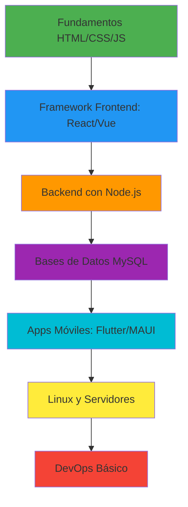

# ¡Hola! 👋 Soy Alberto Emiliano Grajales Jiménez

<div align="center">

### 🚀 Desarrollador Junior | 💻 Aprendiendo Desarrollo Full-Stack | 🌱 En Crecimiento Constante


</div>

---

## 👨‍💻 Sobre Mí

> *"El viaje de mil millas comienza con un solo paso"* - Lao Tzu

Soy un **desarrollador junior** apasionado por la tecnología y el desarrollo de software. Estoy en las primeras etapas de mi carrera, aprendiendo los fundamentos del desarrollo web, móvil y administración de sistemas.  Cada día es una oportunidad para escribir mejor código y entender nuevos conceptos. 

🌱 **Actualmente aprendiendo**: Desarrollo web moderno, aplicaciones multiplataforma y administración básica de servidores Linux

📚 **Mi enfoque**: Aprender haciendo, cometer errores y mejorar constantemente

💡 **Mi meta**: Convertirme en un desarrollador full-stack competente

⚡ **Dato curioso**: Me encanta experimentar con nuevas tecnologías, aunque todavía estoy dominando las básicas

---

## 🛠️ Tecnologías que Estoy Aprendiendo

### 💻 Lenguajes de Programación

```text
HTML/CSS     ████████░░░░░░░░░░░░  40% (Lo básico)
JavaScript   ██████░░░░░░░░░░░░░░  30% (Fundamentos)
C#           █████░░░░░░░░░░░░░░░  25% (Iniciando)
Python       ████░░░░░░░░░░░░░░░░  20% (Scripts básicos)
SQL          █████░░░░░░░░░░░░░░░  25% (Consultas simples)
Kotlin       ███░░░░░░░░░░░░░░░░░  15% (Explorando)
```

### 🎨 Frontend

<p align="left">
  
  
  
  
  
  
</p>

> 📚 = Actualmente aprendiendo

### 📱 Desarrollo Móvil

<p align="left">
  
  
  
</p>

### ⚙️ Backend

<p align="left">
  
  
  
  
</p>

### 🗄️ Bases de Datos

<p align="left">
  
  
</p>

### 🐧 Sistemas & Servidores (Explorando)

<p align="left">
  
  
  
</p>

---

## 💼 Lo Que Estoy Practicando

<table>
<tr>
<td width="50%">

### 🎨 Frontend Básico
- 🌐 Páginas web con **HTML** y **CSS**
- ✨ Interactividad con **JavaScript**
- 📚 Aprendiendo **React** y **Vue.js**
- 📱 Diseño responsive básico

</td>
<td width="50%">

### 📱 Apps Multiplataforma
- 🔷 Experimentando con **.NET MAUI**
- 📲 Primeros pasos en **Flutter**
- 📱 Explorando **Kotlin** para Android
- 🧪 Creando proyectos de práctica

</td>
</tr>
<tr>
<td width="50%">

### ⚙️ Backend & Datos
- 🔌 APIs simples con **Express.js**
- 🗄️ Consultas básicas en **MySQL**
- 🐍 Scripts de automatización con **Python**
- 📖 Aprendiendo arquitectura de APIs

</td>
<td width="50%">

### 🖥️ Servidores Linux
- 🐧 Comandos básicos de **Linux**
- 🔒 Introducción a **SELinux**
- 🌐 Configuración de servidores web
- 📚 Montaje y administración de servicios

</td>
</tr>
</table>

---

## 🎯 Proyectos de Práctica

<details>
<summary>📂 Ver mis experimentos y proyectos de aprendizaje</summary>

### 🌐 Web Básico
- ✅ Sitio web personal con HTML/CSS
- ✅ To-Do List con JavaScript vanilla
- 🔄 Blog simple con React (en progreso)
- 📋 Portafolio interactivo con Vue.js (planeado)

### 📱 Aplicaciones Móviles
- 🔄 Primera app con . NET MAUI (en progreso)
- 📋 Calculadora con Flutter (planeado)
- 📋 App de notas con Kotlin (explorando)

### 🗄️ Backend
- ✅ API REST básica con Express.js
- 🔄 CRUD con MySQL (practicando)
- 📋 Sistema de autenticación simple (siguiente paso)

### 🐧 Servidores
- 🔄 Servidor web local con Apache (aprendiendo)
- 📋 Configuración de SELinux (explorando)

</details>

---

## 📊 Estadísticas de GitHub

<div align="center">
  
  
</div>

---

## 🎓 Mi Plan de Aprendizaje 2026



### 📅 Roadmap Trimestral

**Q1 2026 - Fundamentos Sólidos**
- [ ] Dominar JavaScript ES6+
- [ ] Completar curso de React básico
- [ ] Crear 3 proyectos web completos
- [ ] Practicar Git y GitHub diariamente

**Q2 2026 - Backend y Datos**
- [ ] Node.js y Express. js intermedio
- [ ] Diseño de bases de datos relacionales
- [ ] API RESTful completa
- [ ] Autenticación JWT

**Q3 2026 - Desarrollo Móvil**
- [ ] Flutter: Widgets y navegación
- [ ] . NET MAUI: Primera app funcional
- [ ] Kotlin: Fundamentos Android
- [ ] Publicar una app de práctica

**Q4 2026 - Sistemas y DevOps**
- [ ] Linux: Administración básica
- [ ] SELinux: Configuración y políticas
- [ ] Docker: Contenedores básicos
- [ ] Deploy de aplicaciones

---

## 🤝 Conectemos

<p align="center">
  <a href="https://github.com/Doker367">
    
  </a>
  <a href="mailto:tu-email@ejemplo.com">
    
  </a>
  <a href="https://linkedin.com/in/tu-perfil">
    
  </a>
</p>

---

<div align="center">

### 💭 Mi Filosofía

*"No importa qué tan lento vayas, siempre y cuando no te detengas"* - Confucio

**Estoy aprendiendo en público.  Cada commit es un paso adelante 🚀**

**⭐ Si también estás aprendiendo, ¡conectemos y aprendamos juntos!  ⭐**


</div>

---

## 📚 Recursos que Me Están Ayudando

<details>
<summary>🔖 Recursos de aprendizaje</summary>

### 🌐 Frontend
- 📘 [MDN Web Docs](https://developer.mozilla.org/) - Mi biblia para HTML/CSS/JS
- 📗 [FreeCodeCamp](https://www.freecodecamp.org/) - Cursos interactivos
- 📕 [Vue.js Guide](https://vuejs.org/guide/) - Documentación oficial
- 📙 [React Tutorial](https://react.dev/learn) - Aprendiendo React paso a paso

### ⚙️ Backend
- 🐍 [Python. org Tutorial](https://docs.python.org/3/tutorial/) - Python desde cero
- 🟢 [Node.js Docs](https://nodejs.org/docs/latest/api/) - Documentación oficial
- 📗 [Express.js Guide](https://expressjs.com/en/guide/routing.html) - Rutas y middleware

### 📱 Móvil
- 📱 [Flutter Codelabs](https://docs.flutter.dev/codelabs) - Tutoriales prácticos
- 🔷 [. NET MAUI Workshop](https://github.com/dotnet-presentations/dotnet-maui-workshop)
- 📘 [Kotlin Basics](https://kotlinlang.org/docs/basic-syntax.html) - Sintaxis fundamental

### 🐧 Linux & Servidores
- 🐧 [Linux Journey](https://linuxjourney. com/) - Aprender Linux interactivamente
- 🔒 [SELinux Basics](https://wiki.centos.org/HowTos/SELinux) - Primeros pasos
- 📖 [DigitalOcean Tutorials](https://www.digitalocean.com/community/tutorials) - Configuración de servidores

### 🗄️ Bases de Datos
- 🐬 [MySQL Tutorial](https://dev.mysql.com/doc/mysql-tutorial-excerpt/8.0/en/) - Oficial
- 📊 [SQL Teaching](https://www.sqlteaching.com/) - SQL interactivo

</details>

---

<div align="center">

### 🌟 "El código perfecto no existe, pero el código que funciona sí"

**¿Tienes consejos para un desarrollador junior?  ¡Abre un issue o contáctame!**

</div>
