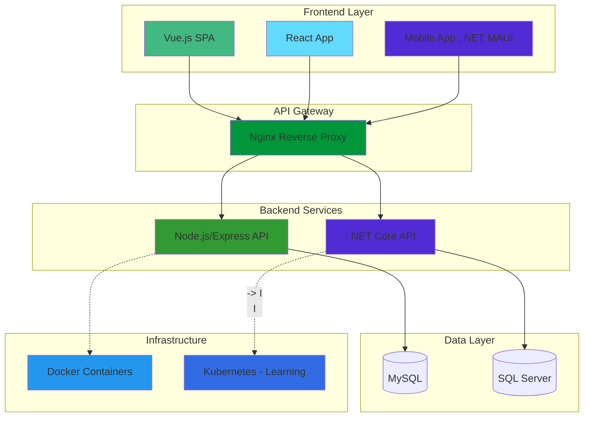
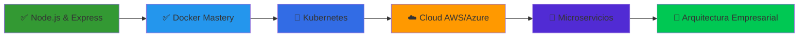

<div align="center">

# ¡Hola! 👋 Soy Alberto Emiliano Grajales Jiménez

### 🚀 Desarrollador Full-Stack | 💻 Especialista en Node.js & . NET | 🐳 DevOps Engineer


**Construyendo soluciones empresariales • APIs escalables • Infraestructura en contenedores**

---

</div>

## 👨‍💻 Sobre Mí

> *"La mejor forma de predecir el futuro es construirlo"* - Peter Drucker

Soy un desarrollador **full-stack** con experiencia en la creación de **soluciones empresariales completas**, desde e-commerce hasta sistemas de logística y paquetería.  Me especializo en **Node.js/Express** y **. NET**, desarrollo de aplicaciones móviles multiplataforma, y arquitecturas basadas en contenedores con Docker. 

🔭 **Actualmente trabajando en**: Proyectos empresariales con Node.js, .NET, Vue.js y orquestación de contenedores

🌱 **Aprendiendo**: Kubernetes, microservicios avanzados y arquitecturas cloud-native

💼 **Experiencia en**: E-commerce, sistemas de paquetería, centros de datos, inventarios y aplicaciones móviles

⚡ **Apasionado por**: Contenedores, DevOps, APIs RESTful y automatización

---

## 🛠️ Stack Tecnológico

### 💻 Lenguajes & Frameworks

```text
Node.js/Express ████████████████░░░░  80% ⭐ Principal
JavaScript      ████████████████░░░░  80% ⭐ Dominio
C# / .NET       ████████████░░░░░░░░  60%
SQL             ███████████░░░░░░░░░  55%
HTML/CSS        █████████████░░░░░░░  65%
Python          ██████░░░░░░░░░░░░░░  30%
Kotlin          ████████░░░░░░░░░░░░  40%
```

### 🎨 Frontend

<p align="left">
  
  
  
  
  
  
</p>

### ⚙️ Backend & APIs

<p align="left">
  
  
  
  
  
</p>

### 📱 Desarrollo Móvil

<p align="left">
  
  
  
</p>

### 🗄️ Bases de Datos

<p align="left">
  
  
  
</p>

### 🐳 DevOps & Infraestructura

<p align="left">
  
  
  
  
  
  
</p>

---

## 💼 Proyectos en Producción

### 📦 [ManyBox Enviox](https://manyboxenviox.com/) - Sistema de Paquetería Integral

**Stack**: Node.js + Express. js + MySQL + Docker + Nginx

<div align="center">

[](https://manyboxenviox.com/)

</div>

```yaml
Plataforma Web (Node.js + Express):
  Features:
    - 🌐 Portal de compra de guías de envío
    - 💰 Sistema de cotización automática
    - 📋 Gestión de paquetes y rastreo
    - 💳 Procesamiento de pagos en línea
    - 📊 Dashboard administrativo
    - 📈 Reportes y analíticas
  
  Stack Técnico:
    Backend: Node.js + Express. js
    Frontend: HTML5, CSS3, JavaScript
    Database: MySQL
    Auth: JWT + Sessions
    
App Móvil (Choferes):
  Plataforma: . NET MAUI
  Features:
    - 📱 Monitoreo de rutas en tiempo real
    - 🗺️ Geolocalización GPS
    - ✅ Control de entregas y recolecciones
    - 📸 Captura de evidencias fotográficas
    - 🔔 Notificaciones push
    - 📡 Sincronización offline
    
  Backend API:
    - 🔌 RESTful API en C# .NET Core
    - 🗄️ SQL Server
    - 📡 WebSockets para tracking en vivo
    - 🔐 Autenticación JWT
    
Infraestructura:
  Deployment:
    - 🐳 Contenedores Docker
    - 🔄 Nginx como reverse proxy
    - 🚀 Orquestación de microservicios
    - 🛡️ SELinux para seguridad
    - 📊 Monitoreo y logs
```

**Impacto**:
- ✅ **500+ guías** procesadas mensualmente
- ✅ Reducción del **40%** en tiempo de gestión
- ✅ Tracking en **tiempo real** para clientes
- ✅ Alta disponibilidad con **99.9% uptime**

---

### 🏢 [LARCAD](https://www. larcad.mx/) - Centro de Datos

**Stack**: Vue.js + Node.js + Docker

<div align="center">

[](https://www.larcad.mx/)

</div>

```yaml
Frontend:
  Framework: Vue.js
  Features:
    - 🎨 SPA moderna y responsive
    - ⚡ Componentes reutilizables
    - 🎭 Interfaz dinámica
    - 📱 Mobile-first design
    - 🔄 State management con Vuex
    
Backend:
  Stack: Node.js + Express
  Features:
    - 🔌 API RESTful
    - 🗄️ Gestión de recursos del centro de datos
    - 👥 Sistema de administración
    - 🔒 Control de accesos
    - 📊 Panel de monitoreo
    
Infraestructura:
  Deploy:
    - 🐳 Dockerizado para alta disponibilidad
    - 🌐 Nginx/Apache como web server
    - 🛡️ SELinux para hardening
    - 🔐 SSL/TLS certificates
    - ☁️ Load balancing
```

**Características Destacadas**:
- ✅ **Vue.js 3** con Composition API
- ✅ **Performance optimizado** con lazy loading
- ✅ **Arquitectura escalable** basada en componentes
- ✅ **Responsive design** para todos los dispositivos

---

### 🛒 E-Commerce "Cielo y Tierra" - Tienda Posh

**Stack**: Node.js + Express. js + MySQL + Docker

```yaml
Plataforma:
  Backend: Node.js + Express.js
  Frontend: HTML5, CSS3, JavaScript (Vanilla/React)
  Database: MySQL
  
Features:
  Catálogo:
    - 🛍️ Productos con categorías
    - 🔍 Búsqueda y filtros avanzados
    - 🖼️ Galería de imágenes
    - ⭐ Sistema de reseñas
    
  Carrito de Compras:
    - 🛒 Carrito persistente
    - 💰 Cálculo de envío automático
    - 🎁 Cupones de descuento
    - 📦 Gestión de inventario en tiempo real
    
  Pagos y Usuarios:
    - 💳 Integración de pagos (Stripe/PayPal)
    - 👤 Autenticación de usuarios
    - 📧 Sistema de correos (confirmación, envío)
    - 🔐 Seguridad con JWT
    
  Administración:
    - 📊 Dashboard administrativo
    - 📈 Reportes de ventas
    - 🏷️ Gestión de productos
    - 📦 Control de pedidos
    
Infraestructura:
  - 🐳 Docker Compose para desarrollo
  - 🌐 Nginx reverse proxy
  - 🗄️ MySQL con replicación
  - 📊 PM2 para gestión de procesos Node.js
```

**Logros**:
- ✅ **100+ productos** en catálogo
- ✅ Sistema de **pagos seguro**
- ✅ **Panel admin** completo
- ✅ **Mobile responsive**

---

### 📱 Sistema de Inventariado Móvil

**Stack**: . NET MAUI + . NET Core API + SQL Server + Docker

```yaml
App Móvil (. NET MAUI):
  Características:
    - 📦 Escaneo de códigos QR/Barras
    - ✏️ Registro de productos en tiempo real
    - 📊 Reportes de inventario
    - 🔄 Sincronización offline
    - 📸 Captura de fotos de productos
    - 🏷️ Etiquetado y categorización
    
Backend API (. NET Core):
  Features:
    - 🔌 RESTful API en C#
    - 🗄️ SQL Server database
    - 🔐 Autenticación JWT
    - 📈 Analytics de inventario
    - 📡 Real-time sync
    
Deploy:
  - 🐳 Contenedores Docker
  - 🌐 Nginx reverse proxy
  - 🔄 Auto-scaling
  - 📊 Monitoring con logs
```

**Ventajas**:
- ✅ **Multiplataforma** (Android/iOS/Windows)
- ✅ **Modo offline** con sincronización
- ✅ **Escaneo rápido** de productos
- ✅ **Reportes en tiempo real**

---

## 🐳 Experiencia en DevOps

<table>
<tr>
<td width="50%">

### 🔧 Containerización con Docker

```dockerfile
# Ejemplo: Node.js App
FROM node:18-alpine
WORKDIR /app
COPY package*.json ./
RUN npm ci --only=production
COPY . .
EXPOSE 3000
CMD ["node", "server. js"]
```

```dockerfile
# Ejemplo: .NET App
FROM mcr.microsoft.com/dotnet/aspnet:8.0
WORKDIR /app
COPY bin/Release/net8.0/publish/ .
EXPOSE 80
ENTRYPOINT ["dotnet", "MiApp.dll"]
```

**Experiencia**:
- ✅ Dockerfiles multi-stage
- ✅ Docker Compose para stacks completos
- ✅ Optimización de imágenes
- ✅ Redes y volúmenes personalizados
- ✅ Docker Swarm (básico)

</td>
<td width="50%">

### 🎯 Orquestación de Servicios

```yaml
# docker-compose.yml
version: '3.8'
services:
  app:
    build: ./app
    ports: ["3000:3000"]
    environment:
      - NODE_ENV=production
    depends_on:
      - db
      
  nginx:
    image: nginx:alpine
    ports: ["80:80", "443:443"]
    volumes:
      - ./nginx.conf:/etc/nginx/nginx.conf
      - ./ssl:/etc/nginx/ssl
    depends_on:
      - app
      
  db:
    image: mysql:8.0
    volumes:
      - db-data:/var/lib/mysql
    environment:
      MYSQL_ROOT_PASSWORD: ${DB_PASSWORD}

volumes:
  db-data:
```

**En producción**:
- ✅ Múltiples proyectos en Docker
- ✅ Reverse proxy con Nginx
- 🚀 Migrando a **Kubernetes**

</td>
</tr>
<tr>
<td width="50%">

### 🌐 Configuración de Servidores Web

**Nginx** (Principal):
```nginx
upstream backend {
    server app:3000;
}

server {
    listen 80;
    server_name manyboxenviox.com;
    
    location / {
        proxy_pass http://backend;
        proxy_set_header Host $host;
        proxy_set_header X-Real-IP $remote_addr;
    }
}
```

**Apache** (Alternativo):
- ✅ Virtual hosts
- ✅ SSL/TLS configuration
- ✅ . htaccess optimization
- ✅ Mod_rewrite para SPAs

</td>
<td width="50%">

### 🐧 Administración Linux

**Habilidades**:
- ✅ **SELinux**: Políticas personalizadas
- ✅ **Systemd**: Gestión de servicios
- ✅ **Shell Scripting**: Automatización
- ✅ **SSH**: Configuración segura
- ✅ **Firewall**: iptables, firewalld
- ✅ **Logs**: journalctl, syslog

**Tareas Comunes**:
```bash
# Montaje de servidores
$ systemctl start nginx
$ docker-compose up -d
$ systemctl enable myapp. service

# Monitoreo
$ htop
$ docker stats
$ tail -f /var/log/nginx/access.log
```

</td>
</tr>
</table>

---

## 🎯 Arquitectura de Soluciones

<div align="center">



</div>

---

## 📊 Estadísticas de GitHub

<div align="center">
  
  
</div>

---

## 🎓 Roadmap de Crecimiento 2026



### 📅 Objetivos 2026

**Q1 - Consolidar DevOps**
- [x] ✅ Dominar Docker y Docker Compose
- [ ] 🔄 Certificación Kubernetes (CKA)
- [ ] 📚 CI/CD con GitHub Actions
- [ ] 🏗️ Terraform para IaC

**Q2 - Cloud & Escalabilidad**
- [ ] ☁️ AWS Solutions Architect
- [ ] 🚀 Desplegar en EKS/AKS
- [ ] 🔧 Microservicios con Node.js
- [ ] 📡 Service Mesh (Istio)

**Q3 - Mobile & Cross-Platform**
- [ ] 📱 App en producción con Flutter
- [ ] 🔷 . NET MAUI avanzado
- [ ] 📲 Kotlin: Jetpack Compose
- [ ] 🏪 Publicar en App Stores

**Q4 - Arquitectura Senior**
- [ ] 🏗️ Event-Driven Architecture
- [ ] 📊 GraphQL APIs
- [ ] 🎯 Design Patterns avanzados
- [ ] 👥 Mentoría y liderazgo técnico

---

## 🏆 Habilidades Destacadas

<div align="center">

| Categoría | Tecnologías | Nivel | Proyectos |
|-----------|-------------|-------|-----------|
| **Backend Node.js** | Express, REST APIs | ⭐⭐⭐⭐⭐ | ManyBox, E-commerce |
| **Frontend** | Vue.js, React, HTML/CSS/JS | ⭐⭐⭐⭐ | LARCAD, Apps web |
| **Backend .NET** | C#, ASP.NET Core | ⭐⭐⭐⭐ | APIs, Mobile backends |
| **Mobile** | .NET MAUI, Flutter, Kotlin | ⭐⭐⭐⭐ | Inventario, Paquetería |
| **DevOps** | Docker, Nginx, Apache | ⭐⭐⭐⭐⭐ | Todos los proyectos |
| **Databases** | MySQL, SQL Server | ⭐⭐⭐⭐ | E-commerce, APIs |
| **Linux** | Administración, SELinux | ⭐⭐⭐⭐ | Servidores producción |
| **Kubernetes** | Orquestación (Aprendiendo) | ⭐⭐⭐ | Migración en progreso |

</div>

---

## 🤝 Conectemos

<p align="center">
  <a href="https://github.com/Doker367">
    
  </a>
  <a href="mailto:tu-email@ejemplo.com">
    
  </a>
  <a href="https://linkedin.com/in/tu-perfil">
    
  </a>
  <a href="https://twitter.com/tu-usuario">
    
  </a>
</p>

---

<div align="center">

### 💭 Filosofía de Desarrollo

```javascript
const miEnfoque = {
  backend: "Node.js para escalabilidad, .NET para robustez",
  frontend: "Vue.js para dinamismo, React para ecosistema",
  mobile: ". NET MAUI para multiplataforma nativa",
  devops: "Docker para desarrollo, Kubernetes para producción",
  database: "MySQL para rapidez, SQL Server para empresas",
  objetivo: "Crear soluciones que resuelvan problemas reales"
};

console.log(miEnfoque);
// Output: "Código limpio, arquitectura escalable, aprendizaje continuo"
```

---

### 🌟 Proyectos en Producción

[](https://manyboxenviox.com/)
[](https://www.larcad.mx/)
[](#)

---

**⭐ Si te gustan mis proyectos, considera seguirme y colaborar ⭐**


### 💼 ¿Buscas un desarrollador Full-Stack con experiencia real?

**¡Trabajemos juntos! ** Contáctame para proyectos de:
- 🌐 Aplicaciones web empresariales
- 📱 Apps móviles multiplataforma
- 🔌 APIs RESTful escalables
- 🐳 Infraestructura con Docker/Kubernetes

</div>

---

## 📚 Recursos & Certificaciones

<details>
<summary>🎓 Recursos de aprendizaje</summary>

### 📖 Actualmente Estudiando

**Kubernetes & Orquestación**
- 🎯 [Kubernetes Documentation](https://kubernetes.io/docs/)
- 📘 [Kubernetes for Developers](https://www.udemy.com/course/kubernetes-for-developers/)
- 🎓 Preparando certificación CKAD

**Cloud Computing**
- ☁️ [AWS Certified Developer](https://aws.amazon.com/certification/certified-developer-associate/)
- 🔧 [Azure for Node.js Developers](https://learn.microsoft.com/azure/developer/javascript/)

**Node.js Avanzado**
- 🟢 [Node.js Best Practices](https://github.com/goldbergyoni/nodebestpractices)
- 🎯 Microservices with Node.js
- 📡 Real-time con WebSockets

### 🛠️ Stack de Herramientas

**Desarrollo**
- **IDEs**: VS Code, Visual Studio, WebStorm
- **API Testing**: Postman, Insomnia, Thunder Client
- **Database**: MySQL Workbench, DBeaver, SSMS
- **Version Control**: Git, GitHub, GitKraken

**DevOps**
- **Containers**: Docker Desktop, Portainer
- **Servers**: Nginx, Apache
- **Monitoring**: PM2, htop, Docker stats
- **CI/CD**: GitHub Actions (aprendiendo)

**Mobile**
- **Android Studio** para Kotlin
- **Visual Studio** para .NET MAUI
- **VS Code** para Flutter

</details>

---

<div align="center">

### 🔥 "El código que funciona en producción vale más que mil tutoriales"


**¿Tienes un proyecto?   ¡Hablemos!** 🚀

</div>
